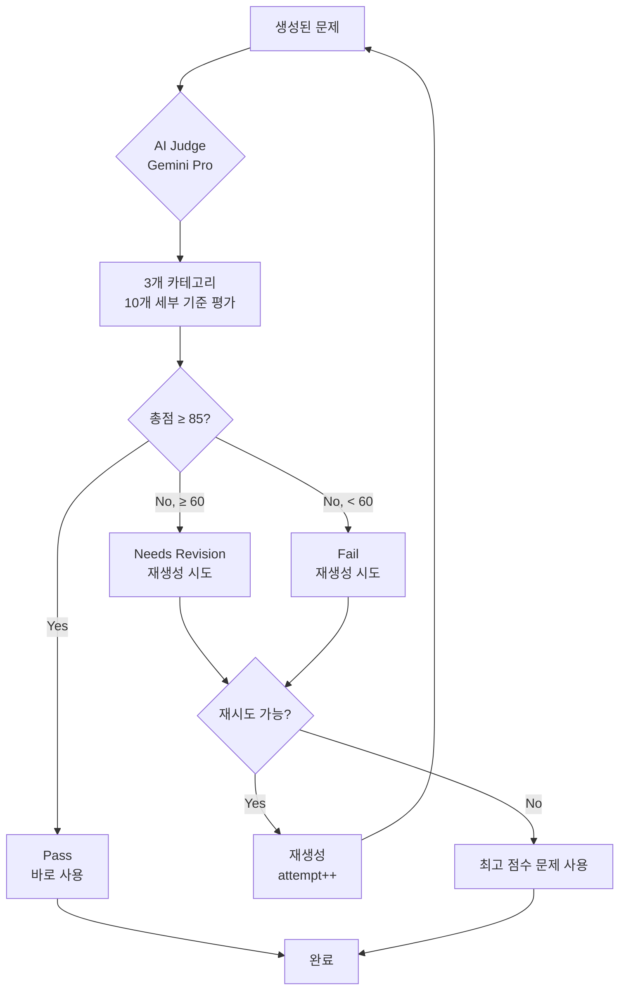

# 영어 문제 생성 시스템 플로우 (English Problem Generation Flow)

## 시스템 개요

영어 문제 생성 시스템은 **Gemini 2.0 Flash**와 **Gemini 2.5 Pro**를 활용한 이중 검증 시스템입니다.

### 핵심 특징

- **이중 AI 모델**: Gemini 2.0 Flash(생성) + Gemini 2.5 Pro(검증)
- **AI Judge 검증**: 모든 문제는 3가지 카테고리, 10가지 세부 기준으로 평가 (총 100점)
- **재시도 메커니즘**: 불합격 문제에 대한 자동 재생성 (최대 3회)
- **병렬 처리**: ThreadPoolExecutor 활용한 고속 생성
- **3영역 지원**: 독해(Reading), 문법(Grammar), 어휘(Vocabulary)
- **3단계 난이도**: 하(기본), 중(표준), 상(도전)
- **CEFR 기준**: A2, B1, B2, B2+ 수준별 단어 및 문장 구조

### 사용 모델

- **문제 생성**: Gemini 2.0 Flash (`gemini-2.0-flash-exp`)
- **AI Judge 검증**: Gemini 2.5 Pro (`gemini-2.0-flash-thinking-exp`)

---

## 전체 문제 생성 플로우

### 1단계: 사용자 요청 접수

```
POST /api/english/worksheet-generate
{
  "school_level": "중학교",
  "grade": 1,
  "total_questions": 10,
  "subjects": ["reading", "grammar", "vocabulary"],
  "subject_details": {
    "reading_types": [1, 2, 3],
    "grammar_categories": [1, 2],
    "vocabulary_categories": [1]
  },
  "difficulty_distribution": [
    {"difficulty": "하", "ratio": 40},
    {"difficulty": "중", "ratio": 40},
    {"difficulty": "상", "ratio": 20}
  ],
  "subject_distribution": [
    {"subject": "reading", "ratio": 50},
    {"subject": "grammar", "ratio": 30},
    {"subject": "vocabulary", "ratio": 20}
  ]
}
```

### 2단계: Celery 비동기 태스크 실행

```python
# tasks.py:generate_english_worksheet_task
task = generate_english_worksheet_task.delay(request_data)
→ task_id 반환 (예: "abc123-def456-...")
```

**태스크 진행 상태**:

```python
# 10% - 문제 생성 옵션 처리
current_task.update_state(state='PROGRESS', meta={'current': 10, 'status': '문제 생성 옵션 처리 중...'})

# 30% - 프롬프트 생성
current_task.update_state(state='PROGRESS', meta={'current': 30, 'status': '프롬프트 생성 중...'})

# 60% - 문제 및 지문 병렬 생성
current_task.update_state(state='PROGRESS', meta={'current': 60, 'status': '문제 및 지문 병렬 생성 중...'})

# 90% - 워크시트 조립
current_task.update_state(state='PROGRESS', meta={'current': 90, 'status': '워크시트 조립 중...'})

# 100% - 완료
current_task.update_state(state='PROGRESS', meta={'current': 100, 'status': '완료!'})
```

### 3단계: 문제 분배 계산

```python
# question_generator.py:PromptGenerator.get_distribution_summary()

# 1. 영역별 분배 (총 10문제)
{
  "reading": 5,    # 50%
  "grammar": 3,    # 30%
  "vocabulary": 2  # 20%
}

# 2. 난이도별 분배
{
  "하": 4,  # 40%
  "중": 4,  # 40%
  "상": 2   # 20%
}

# 3. 독해 문제 세부 분배 (5문제)
{
  "main_idea": 2,        # 주제/제목
  "detail": 2,           # 세부사항
  "inference": 1         # 추론
}

# 4. 문법 문제 세부 분배 (3문제)
{
  "tense": 2,           # 시제
  "preposition": 1      # 전치사
}

# 5. 어휘 문제 세부 분배 (2문제)
{
  "synonym": 2          # 동의어
}
```

### 4단계: 프롬프트 생성

```python
# question_generator.py:PromptGenerator.generate_question_prompts()

question_prompts = [
  {
    "question_id": 1,
    "needs_passage": True,  # 독해 문제
    "prompt": "독해 문제 생성 프롬프트...",
    "metadata": {
      "school_level": "중학교",
      "grade": 1,
      "cefr_level": "A2",
      "difficulty": "하",
      "subject": "reading",
      "detail_type": "main_idea"
    }
  },
  {
    "question_id": 2,
    "needs_passage": False,  # 문법 문제
    "prompt": "문법 문제 생성 프롬프트...",
    "metadata": {...}
  },
  ...
]
```

**독해 문제 프롬프트 예시**:

```python
f"""You are an expert English test item developer for Korean {school_level} {grade}학년 students.

**Task**: Create ONE reading comprehension question with its passage.

**Requirements**:
- **CEFR Level**: {cefr_level}
- **Difficulty**: {difficulty} (하: 기본적, 중: 표준적, 상: 도전적)
- **Reading Type**: {detail_type_name}
- **Text Type**: {text_type_name}

**Text Type Specifications**:
{text_type_specifications}

**Output Format** (strict JSON):
{{
  "passage": {{
    "passage_id": 1,
    "passage_type": "{text_type_id}",
    "passage_content": {{...}},
    "korean_translation": "...",
    "related_questions": [1]
  }},
  "question": {{
    "question_id": 1,
    "question_text": "...",
    "question_type": "multiple_choice",
    "question_subject": "reading",
    "question_difficulty": "{difficulty}",
    "question_detail_type": "{detail_type_name}",
    "question_choices": ["A", "B", "C", "D"],
    "question_passage_id": 1,
    "correct_answer": 0,
    "explanation": "...",
    "learning_point": "..."
  }}
}}
"""
```

**문법 문제 프롬프트 예시**:

```python
f"""You are an expert English test item developer for Korean {school_level} {grade}학년 students.

**Task**: Create ONE grammar question.

**Requirements**:
- **CEFR Level**: {cefr_level}
- **Difficulty**: {difficulty}
- **Grammar Category**: {category_name}
- **Vocabulary Pool**: {vocabulary_list}  # 학년 수준에 맞는 단어 목록

**Output Format** (strict JSON):
{{
  "question_id": 2,
  "question_text": "다음 문장에서 밑줄 친 부분에 알맞은 것은?",
  "question_type": "multiple_choice",
  "question_subject": "grammar",
  "question_difficulty": "{difficulty}",
  "question_detail_type": "{category_name}",
  "question_choices": ["A", "B", "C", "D"],
  "correct_answer": 0,
  "example_content": "She _____ to school every day.",
  "example_korean_translation": "그녀는 매일 학교에 간다.",
  "explanation": "...",
  "learning_point": "..."
}}
"""
```

### 5단계: 문제 병렬 생성 (AI Judge 검증 포함)

```python
# tasks.py:generate_questions_parallel()

with ThreadPoolExecutor(max_workers=len(question_prompts)) as executor:
    # 각 문제를 병렬로 생성 + 검증
    futures = [
        executor.submit(generate_with_validation, prompt)
        for prompt in question_prompts
    ]

    for future in as_completed(futures):
        question_data, validation_result = future.result()
        results.append(question_data)
        validation_results.append(validation_result)
```

**단일 문제 생성 + 검증 로직**:

```python
def generate_with_validation(prompt_info):
    """단일 문제 생성 + AI Judge 검증 (최대 3회 시도)"""

    best_question = None
    best_validation = None
    best_score = -1

    for attempt in range(1, VALIDATION_SETTINGS['max_retries'] + 1):
        # 1. Gemini Flash로 문제 생성
        question_data = call_gemini_for_question(prompt_info)

        # 2. Gemini Pro로 AI Judge 검증
        judge_prompt = QuestionJudge.create_judge_prompt(question_data, metadata)
        validation_result = call_gemini_for_validation(judge_prompt)

        # 3. 최고 점수 추적
        if validation_result.total_score > best_score:
            best_score = validation_result.total_score
            best_question = question_data
            best_validation = validation_result

        # 4. Pass 판정이면 바로 사용
        if validation_result.final_judgment == "Pass":
            print(f"문제 {question_id}: Pass (attempt {attempt}, score {validation_result.total_score}/100)")
            return question_data, validation_result

        # 5. 재시도 필요
        print(f"문제 {question_id}: {validation_result.final_judgment} (attempt {attempt}, score {validation_result.total_score}/100)")

    # 6. 최대 시도 후 최고 점수 문제 사용
    print(f"문제 {question_id}: 최대 재시도 도달. 최고 점수 버전 사용 (score {best_score}/100)")
    return best_question, best_validation
```

### 6단계: 워크시트 조립

```python
# tasks.py:assemble_worksheet()

worksheet = {
    "worksheet_id": 1,
    "worksheet_name": "",
    "worksheet_date": "2025-10-02",
    "worksheet_time": "14:30",
    "worksheet_duration": "60",
    "worksheet_subject": "english",
    "worksheet_level": "중학교",
    "worksheet_grade": 1,
    "problem_type": "혼합형",
    "total_questions": 10,
    "passages": [
        {
            "passage_id": 1,
            "passage_type": "article",
            "passage_content": {...},
            "korean_translation": "...",
            "related_questions": [1, 2]
        },
        ...
    ],
    "questions": [
        {
            "question_id": 1,
            "question_text": "...",
            "question_type": "multiple_choice",
            "question_subject": "reading",
            "question_difficulty": "하",
            "question_detail_type": "main_idea",
            "question_choices": ["A", "B", "C", "D"],
            "question_passage_id": 1,
            "correct_answer": 0,
            "explanation": "...",
            "learning_point": "..."
        },
        ...
    ]
}
```

---

## AI Judge 검증 시스템

### 검증 절차



### 검증 기준 상세 (총 100점)

#### A. Alignment (30점)

| 항목                       | 배점 | 설명                           |
| -------------------------- | ---- | ------------------------------ |
| **curriculum_relevance**   | 10점 | 학년별 교육과정 연계성         |
| **difficulty_consistency** | 10점 | CEFR 레벨 및 난이도 일치성     |
| **topic_appropriateness**  | 10점 | 학습자 연령 및 배경지식 적합성 |

#### B. Content & Question Quality (40점)

| 항목                    | 배점 | 설명                            |
| ----------------------- | ---- | ------------------------------- |
| **passage_quality**     | 10점 | 문법 정확성, 자연스러움, 논리성 |
| **instruction_clarity** | 10점 | 발문의 명확성                   |
| **answer_accuracy**     | 10점 | 정답의 명확성 및 지문 근거      |
| **distractor_quality**  | 10점 | 오답 선택지의 매력도            |

#### C. Explanation Quality (30점)

| 항목                          | 배점 | 설명                         |
| ----------------------------- | ---- | ---------------------------- |
| **logical_explanation**       | 10점 | 정답 해설의 논리성           |
| **incorrect_answer_analysis** | 10점 | 오답 해설의 유용성           |
| **additional_information**    | 10점 | 어휘/구문 추가 정보의 정확성 |

### 판정 기준

```python
# validation_config.py:JUDGMENT_THRESHOLDS

if total_score >= 85:
    judgment = "Pass"  # 고품질, 바로 사용
elif total_score >= 60:
    judgment = "Needs Revision"  # 수정 필요
else:
    judgment = "Fail"  # 재생성 필요
```

### AI Judge 프롬프트 구조

```python
# judge.py:QuestionJudge.create_judge_prompt()

prompt = f"""You are an expert English education content evaluator for Korean students.

**[Context]**
* Learner Level: {school_level} {grade}학년
* Target Difficulty (CEFR): {cefr_level}
* Intended Difficulty: {difficulty}

**[Generated Question & Explanation]**
{formatted_question}

**[Evaluation Rubric]**

**A. Alignment (30 points)**
1. Curriculum Relevance (0-10 pts)
2. Difficulty Consistency (0-10 pts)
3. Topic Appropriateness (0-10 pts)

**B. Content & Question Quality (40 points)**
1. Passage Quality (0-10 pts)
2. Instruction Clarity (0-10 pts)
3. Answer Accuracy (0-10 pts)
4. Distractor Quality (0-10 pts)

**C. Explanation Quality (30 points)**
1. Logical Explanation (0-10 pts)
2. Incorrect Answer Analysis (0-10 pts)
3. Additional Information (0-10 pts)

**[Final Judgment Criteria]**
- Total 85-100: Pass
- Total 60-84: Needs Revision
- Total 0-59: Fail

**[Output Format]**
{{
  "final_judgment": "Pass",
  "total_score": 92,
  "curriculum_relevance": 10,
  "difficulty_consistency": 9,
  "topic_appropriateness": 10,
  "alignment_total": 29,
  "alignment_rationale": "...",
  "passage_quality": 9,
  "instruction_clarity": 10,
  "answer_accuracy": 10,
  "distractor_quality": 8,
  "content_quality_total": 37,
  "content_quality_rationale": "...",
  "logical_explanation": 9,
  "incorrect_answer_analysis": 8,
  "additional_information": 9,
  "explanation_quality_total": 26,
  "explanation_quality_rationale": "...",
  "suggestions_for_improvement": ["..."]
}}
"""
```

### 검증 결과 출력 예시

```
 AI Judge 검증 시작...
 AI Judge 검증 완료: Pass (92/100)

문제 1: Pass 판정 (attempt 1, score 92/100)
 문제 2: Needs Revision (attempt 1, score 78/100)
 문제 2: Pass 판정 (attempt 2, score 87/100)
 문제 3: Pass 판정 (attempt 1, score 95/100)

 검증 결과 요약: Pass 10/10, 평균 점수 89.5/100
```

---

## 단일 문제 재생성 플로우

### 사용자 요청

```
POST /api/english/questions/regenerate
{
  "questions": [
    {
      "question_id": 1,
      "question_text": "...",
      "correct_answer": "...",
      "explanation": "..."
    }
  ],
  "passage": {
    "passage_id": 1,
    "passage_content": {...}
  },
  "formData": {
    "feedback": "더 쉽게 만들어주세요",
    "target_items": ["question"],  // or ["passage", "question"]
    "modification_type": "difficulty_adjust"
  }
}
```

### Celery 태스크 실행

```python
# tasks.py:regenerate_english_question_task

task = regenerate_english_question_task.delay(request_data)

# 1. 재생성기 초기화
regenerator = QuestionRegenerator()

# 2. 재생성 실행
success, message, regenerated_questions, regenerated_passage = regenerator.regenerate_from_data(
    questions=request.questions,
    passage=request.passage,
    form_data=request.formData
)

# 3. 결과 반환
return {
    "status": "success",
    "message": message,
    "regenerated_questions": regenerated_questions,
    "regenerated_passage": regenerated_passage
}
```

### 재생성 프롬프트 구조

```python
# question_regenerator.py:QuestionRegenerator._create_regeneration_prompt()

prompt = f"""You are an English education expert. Regenerate the following content based on the user's feedback.

**User Feedback**: {feedback}

**Target Items**: {', '.join(target_items)}

**Current Content**:
{current_content_json}

**Requirements**:
- Maintain the same JSON structure
- Apply the requested modifications
- Ensure quality meets educational standards

**Output**: Return the regenerated content in the same JSON format.
"""
```

---

## 영역별 문제 생성

### 1. 독해 (Reading Comprehension)

#### 지문 유형 (Text Types)

| ID  | 유형           | 설명          | 예시            |
| --- | -------------- | ------------- | --------------- |
| 1   | Article        | 기사          | 뉴스, 잡지 기사 |
| 2   | Dialogue       | 대화          | 2인 이상 대화   |
| 3   | Informational  | 정보성 텍스트 | 공지, 안내문    |
| 4   | Correspondence | 서신          | 이메일, 편지    |
| 5   | Review         | 리뷰          | 제품/영화 리뷰  |
| 6   | Blog Post      | 블로그        | 개인 블로그 글  |

#### 문제 유형 (Question Types)

| ID  | 유형                  | 설명           |
| --- | --------------------- | -------------- |
| 1   | Main Idea             | 주제/제목 파악 |
| 2   | Detail                | 세부 정보 이해 |
| 3   | Inference             | 추론/함의      |
| 4   | Purpose               | 목적 파악      |
| 5   | Vocabulary in Context | 문맥 속 어휘   |

#### 지문 구조 예시

**Article (기사)**:

```json
{
  "passage_content": {
    "content": [
      {
        "type": "title",
        "value": "New Park Opens in City Center"
      },
      {
        "type": "paragraph",
        "value": "A new park opened in the city center last week..."
      }
    ]
  }
}
```

**Dialogue (대화)**:

```json
{
  "passage_content": {
    "speakers": ["Tom", "Sarah"],
    "lines": [
      { "speaker": "Tom", "text": "Hey Sarah, have you been to the new park?" },
      { "speaker": "Sarah", "text": "Not yet, but I heard it's amazing!" }
    ]
  }
}
```

### 2. 문법 (Grammar)

#### 문법 카테고리

| ID  | 카테고리    | 설명                    |
| --- | ----------- | ----------------------- |
| 1   | Tense       | 시제 (현재, 과거, 미래) |
| 2   | Preposition | 전치사                  |
| 3   | Article     | 관사 (a, an, the)       |
| 4   | Conjunction | 접속사                  |
| 5   | Modal Verb  | 조동사                  |

#### 문법 문제 구조

```json
{
  "question_id": 2,
  "question_text": "다음 문장에서 밑줄 친 부분에 알맞은 것은?",
  "question_type": "multiple_choice",
  "question_subject": "grammar",
  "question_difficulty": "중",
  "question_detail_type": "tense",
  "question_choices": ["go", "goes", "went", "will go"],
  "correct_answer": 1,
  "example_content": "She _____ to school every day.",
  "example_korean_translation": "그녀는 매일 학교에 간다.",
  "explanation": "every day는 현재 습관을 나타내는 표현이므로 현재시제를 사용합니다. 주어가 3인칭 단수이므로 goes가 정답입니다.",
  "learning_point": "현재시제 - 3인칭 단수 주어는 동사에 -s/-es를 붙입니다."
}
```

### 3. 어휘 (Vocabulary)

#### 어휘 카테고리

| ID  | 카테고리       | 설명   |
| --- | -------------- | ------ |
| 1   | Synonym        | 동의어 |
| 2   | Antonym        | 반의어 |
| 3   | Word Formation | 파생어 |
| 4   | Collocation    | 연어   |

#### 어휘 레벨별 단어 풀

```python
# 중1 수준 단어 풀
# Basic (하): 800-1000단어
# Middle (중/상): 1000-1500단어

# words 테이블에서 추출
basic_words = db.query(Word).filter(Word.level == 'basic').all()
middle_words = db.query(Word).filter(Word.level == 'middle').all()
```

#### 어휘 문제 구조

```json
{
  "question_id": 3,
  "question_text": "다음 밑줄 친 단어와 의미가 가장 비슷한 것은?",
  "question_type": "multiple_choice",
  "question_subject": "vocabulary",
  "question_difficulty": "하",
  "question_detail_type": "synonym",
  "question_choices": ["big", "small", "happy", "sad"],
  "correct_answer": 0,
  "example_content": "The house is very large.",
  "example_korean_translation": "그 집은 매우 크다.",
  "explanation": "large는 '큰'이라는 의미이며, big과 동의어입니다.",
  "learning_point": "large = big (크다)"
}
```

---

## 모듈 구조

### 파일 구성

```
english-service/
├── app/
│   ├── services/
│   │   ├── generation/
│   │   │   ├── question_generator.py       # 프롬프트 생성, 문제 분배
│   │   │   └── distribution_calculator.py  # 비율 계산 유틸
│   │   ├── regeneration/
│   │   │   └── question_regenerator.py     # 단일 문제 재생성
│   │   ├── validation/
│   │   │   ├── judge.py                    # AI Judge 프롬프트 생성
│   │   │   └── validator.py                # 검증 로직
│   │   ├── ai/
│   │   │   ├── gemini_client.py            # Gemini API 클라이언트
│   │   │   └── ai_service.py               # AI 서비스 통합
│   │   └── worksheet_crud/
│   │       ├── worksheet_service.py        # 워크시트 CRUD
│   │       ├── question_service.py         # 문제 CRUD
│   │       └── passage_service.py          # 지문 CRUD
│   ├── routers/
│   │   ├── worksheet_router.py             # 워크시트 엔드포인트
│   │   ├── regeneration_router.py          # 재생성 엔드포인트
│   │   └── grading_router.py               # 채점 엔드포인트
│   ├── core/
│   │   ├── config.py                       # 설정
│   │   └── validation_config.py            # 검증 기준 설정
│   ├── schemas/
│   │   ├── generation.py                   # 생성 요청/응답 스키마
│   │   ├── regeneration.py                 # 재생성 스키마
│   │   ├── validation.py                   # 검증 결과 스키마
│   │   └── worksheet.py                    # 워크시트 스키마
│   ├── models/
│   │   ├── worksheet.py                    # Worksheet 모델
│   │   ├── question.py                     # Question 모델
│   │   ├── passage.py                      # Passage 모델
│   │   └── content.py                      # 지문/문법/어휘 카테고리
│   ├── tasks.py                            # Celery 태스크
│   ├── celery_app.py                       # Celery 설정
│   └── database.py                         # DB 연결
├── data/
│   ├── text_types.json                     # 지문 유형 정의
│   ├── reading_comprehension_types.json    # 독해 문제 유형
│   ├── grammar_categories.json             # 문법 카테고리
│   └── vocabulary_categories.json          # 어휘 카테고리
└── celery_worker.py                        # Celery 워커 실행
```

### 핵심 클래스

#### PromptGenerator (question_generator.py)

```python
class PromptGenerator:
    """프롬프트 생성 및 문제 분배"""

    def get_distribution_summary(self, request_dict: Dict) -> Dict:
        """영역별/난이도별 분배 요약 생성"""

    def generate_question_prompts(self, request_dict: Dict, passages: List, db: Session) -> List[Dict]:
        """각 문제별 프롬프트 생성 (독해는 지문 포함)"""

    def extract_vocabulary_by_difficulty(self, db: Session, difficulty_distribution: List) -> str:
        """난이도별 단어 추출 (words 테이블)"""
```

#### QuestionJudge (judge.py)

```python
class QuestionJudge:
    """AI Judge 프롬프트 생성"""

    @staticmethod
    def create_judge_prompt(question_data: Dict, metadata: Dict) -> str:
        """AI Judge 평가 프롬프트 생성"""

    @staticmethod
    def format_question_for_evaluation(question_data: Dict) -> str:
        """문제를 평가용 형식으로 포맷팅"""
```

#### QuestionRegenerator (question_regenerator.py)

```python
class QuestionRegenerator:
    """단일 문제 재생성"""

    def regenerate_from_data(self, questions: List, passage: Dict, form_data: Dict) -> Tuple:
        """데이터 기반 재생성 (지문 + 문제)"""

    def _create_regeneration_prompt(self, current_content: str, feedback: str, target_items: List) -> str:
        """재생성 프롬프트 생성"""
```

---
