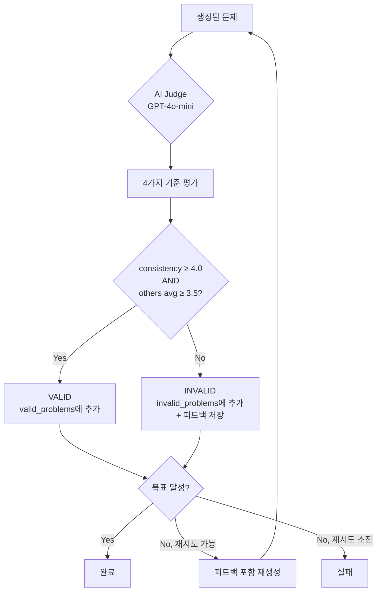

# 수학 문제 생성 시스템 플로우 (Math Problem Generation Flow)

---

## 시스템 개요

수학 문제 생성 시스템은 **Gemini 2.5 Pro**와 **GPT-4o-mini**를 활용한 이중 검증 시스템

### 핵심 특징

- **이중 AI 모델**: Gemini 2.5 Pro(생성) + GPT-4o-mini(검증)
- **AI Judge 검증**: 모든 문제는 4가지 기준으로 평가 (수학정확성, 정답일치, 완결성, 논리성)
- **재시도 메커니즘**: 불합격 문제에 대한 피드백 기반 재생성 (최대 3회)
- **부분 재생성**: 일부 문제만 불합격해도 부족한 개수만 재생성
- **병렬 처리**: ThreadPoolExecutor 활용한 고속 생성
- **TikZ 지원**: 그래프 단원에서 자동 시각화 생성
- **3단계 난이도**: A(직접계산), B(응용번역), C(통합발견)

### 사용 모델

- **문제 생성**: Gemini 2.5 Pro
- **AI Judge 검증**: GPT-4o-mini (OpenAI)

---

## 전체 문제 생성 플로우

### 1단계: 사용자 요청 접수

```
POST /api/worksheets/generate
{
  "school_level": "중학교",
  "grade": 1,
  "semester": "1학기",
  "unit_name": "소인수분해",
  "chapter_name": "소인수분해의 활용",
  "problem_count": 5,
  "difficulty_ratio": {"A": 2, "B": 2, "C": 1},
  "problem_type_ratio": {"multiple_choice": 3, "short_answer": 2},
  "user_prompt": "실생활 문제 포함"
}
```

### 2단계: Celery 비동기 태스크 실행

```python
# tasks.py:generate_math_problems_task
task = generate_math_problems_task.delay(request, user_id)
→ task_id 반환 (예: "abc123-def456-...")
```

### 3단계: 교육과정 데이터 로드

```python
# math_generation_service.py
curriculum_data = self._load_curriculum_data(
    school_level, grade, semester, unit_name, chapter_name
)

# middle1_math_curriculum.json에서 로드
{
  "school_level": "중학교",
  "grade": 1,
  "semester": "1학기",
  "chapters": [
    {
      "unit_name": "소인수분해",
      "chapter_name": "소인수분해의 활용",
      "description": "...",
      "core_concepts": ["최대공약수", "최소공배수"]
    }
  ]
}
```

### 4단계: 프롬프트 생성 및 문제 생성 요청

```python
# prompt_templates.py
prompt = PromptTemplates.build_problem_generation_prompt(
    curriculum_data=curriculum_data,
    user_prompt=user_prompt,
    problem_count=5,
    difficulty_distribution="A단계 2개, B단계 2개, C단계 1개"
)

# 핵심 프롬프트 구조:
"""
You are a Master Test Creator for "SSEN" textbook.

**#1. CORE MISSION**
- Topic: 중1 1학기 - 소인수분해 > 소인수분해의 활용
- User Request: "실생활 문제 포함"
- Total Problems: 5
- Required Distribution: A단계 2개, B단계 2개, C단계 1개

**#2. MENTAL SANDBOX FOR EACH DIFFICULTY LEVEL**

### A-LEVEL SANDBOX: Direct Computation
- Test if student memorized formula
- 1-2 computational steps
- 30초 내 해결 가능
- STRICTLY FORBIDDEN: Word problems

### B-LEVEL SANDBOX: Application & Translation
- Translate situation → equation → solve
- 3-4 steps
- Word problems, real-life scenarios
- STRICTLY FORBIDDEN: Direct computation or pattern discovery

### C-LEVEL SANDBOX: Synthesis & Discovery (HARDEST)
- Synthesize multiple concepts
- 5+ steps with "aha!" moment
- Optimization, pattern discovery, proof
- STRICTLY FORBIDDEN: Just harder B-Level problems
"""
```

### 5단계: Gemini API 호출 및 응답 파싱

```python
# problem_generator.py:_call_ai_and_parse_response()

valid_problems = []
max_retries = 3

for retry_attempt in range(max_retries):
    needed_count = target_count - len(valid_problems)

    # 부족한 개수만큼 프롬프트 조정
    if len(valid_problems) > 0:
        adjusted_prompt = self._adjust_prompt_for_needed_count(
            original_prompt, needed_count
        )

    # Gemini API 호출
    response = self.model.generate_content(adjusted_prompt)
    problems = self._extract_and_parse_json(response.text)

    # AI Judge 검증 (다음 단계)
    ...
```

### 6단계: AI Judge 검증 (GPT-4o-mini)

```python
# problem_generator.py:_validate_with_ai_judge()

for idx, problem in enumerate(problems):
    is_valid, scores, feedback = self._validate_with_ai_judge(problem)

    if is_valid:
        valid_problems.append(problem)
        print(f" 문제 {len(valid_problems)}번: VALID - 평균 {scores['overall_score']:.1f}점")
    else:
        print(f" 문제 {idx+1}번: INVALID - 평균 {scores['overall_score']:.1f}점")
        print(f" 피드백: {feedback}")
        invalid_problems.append({
            "problem": problem,
            "feedback": feedback,
            "scores": scores
        })
```

**AI Judge 검증 기준** (4가지 항목, 각 1-5점):

```python
validation_prompt = """
Evaluation criteria:
1. mathematical_accuracy (1-5): No mathematical or logical errors
2. consistency (1-5): Explanation's answer matches correct_answer
3. completeness (1-5): All required fields present (객관식은 4개 보기)
4. logic_flow (1-5): Explanation is logical and easy to follow

Decision rule:
- consistency ≥ 4.0 (필수)
- AND average of other scores ≥ 3.5
→ "VALID"
"""
```

**검증 상세 출력**:

```
O 문제 1번: VALID - 평균 4.5점 [수학정확성:5.0 정답일치:5.0 완결성:4.0 논리성:4.0]
X 문제 2번: INVALID - 평균 3.2점 [수학정확성:4.0 정답일치:2.5 완결성:3.5 논리성:3.0]
    피드백: 풀이 과정의 마지막 답이 정답과 일치하지 않습니다
```

### 7단계: 재시도 메커니즘 (Feedback-Enhanced Regeneration)

```python
# 불합격 문제가 있고 아직 재시도 가능한 경우
if len(valid_problems) < target_count and retry_attempt < max_retries - 1:
    shortage = target_count - len(valid_problems)
    print(f"부족: {shortage}개 추가 생성 필요 (현재 {len(valid_problems)}/{target_count})")

    # 피드백을 포함한 프롬프트 재구성
    if invalid_problems:
        prompt = self._rebuild_prompt_with_feedback(original_prompt, invalid_problems)
```

**피드백 강화 프롬프트 예시**:

```
[원본 프롬프트]

**IMPORTANT: Previous attempt had issues. Fix these:**

Problem 1 feedback:
- Scores: mathematical_accuracy=4.0, consistency=2.5, completeness=3.5, logic_flow=3.0
- Issue: 풀이 과정의 마지막 답이 정답과 일치하지 않습니다

**MUST ensure**: consistency >= 4 (explanation's answer = correct_answer), all scores >= 3.5
```

### 8단계: 문제 저장 및 워크시트 생성

```python
# tasks.py

# Worksheet 생성
worksheet = Worksheet(
    title=f"{chapter_name} 문제 {problem_count}개",
    teacher_id=user_id,
    school_level=school_level,
    grade=grade,
    semester=semester,
    unit_name=unit_name,
    chapter_name=chapter_name,
    problem_count=problem_count,
    difficulty_ratio=difficulty_ratio,
    problem_type_ratio=problem_type_ratio,
    status=WorksheetStatus.COMPLETED
)
db.add(worksheet)
db.flush()

# Problem 저장 (TikZ 지원)
for idx, problem_data in enumerate(problems):
    problem = Problem(
        worksheet_id=worksheet.id,
        sequence_order=idx + 1,
        problem_type=problem_data['problem_type'],
        difficulty=problem_data['difficulty'],
        question=problem_data['question'],
        choices=json.dumps(problem_data.get('choices')),
        correct_answer=problem_data['correct_answer'],
        explanation=problem_data['explanation'],
        has_diagram=str(problem_data.get('has_diagram', False)).lower(),
        diagram_type=problem_data.get('diagram_type'),
        tikz_code=problem_data.get('tikz_code')  # TikZ LaTeX 코드
    )
    db.add(problem)

db.commit()
```

---

## AI Judge 검증 시스템

### 검증 절차



### 검증 기준 상세

| 항목                      | 설명                               | 점수 범위 |
| ------------------------- | ---------------------------------- | --------- |
| **mathematical_accuracy** | 수학적 오류 없음                   | 1-5       |
| **consistency**           | 풀이의 최종 답 = correct_answer    | 1-5       |
| **completeness**          | 필수 필드 완비 (객관식은 4개 보기) | 1-5       |
| **logic_flow**            | 풀이 논리성 및 이해 용이성         | 1-5       |

**합격 조건**:

1. **consistency ≥ 4.0** (필수, 가장 중요)
2. **AND** (mathematical_accuracy + completeness + logic_flow) / 3 ≥ 3.5

### 코드 예시

```python
# problem_generator.py:717-796

def _validate_with_ai_judge(self, problem: Dict) -> tuple:
    """
    AI Judge로 문제 검증 (OpenAI GPT-4o-mini)
    Returns: (is_valid: bool, scores: dict, feedback: str)
    """

    validation_prompt = f"""You are a math education expert. Please validate the following math problem.

The problem data is as follows:
- Question: {question}
- Correct Answer: {correct_answer}
- Explanation: {explanation}
- Problem Type: {problem_type}
- Choices: {choices_text}

Evaluation criteria:
1. mathematical_accuracy (1-5): No mathematical or logical errors.
2. consistency (1-5): The final answer in the explanation matches the correct_answer.
3. completeness (1-5): All required fields are present (e.g., multiple_choice must have 4 choices).
4. logic_flow (1-5): The explanation is logical and easy to follow.

Return ONLY valid JSON (no markdown, no code blocks):
{{
  "scores": {{"mathematical_accuracy": <score>, "consistency": <score>, "completeness": <score>, "logic_flow": <score>}},
  "overall_score": <average>,
  "decision": "VALID" or "INVALID",
  "feedback": "<brief feedback>"
}}

Decision rule: `consistency` must be 4 or higher, AND the average of the other scores must be 3.5 or higher to be "VALID".
"""

    response = self.openai_client.chat.completions.create(
        model="gpt-4o-mini",
        messages=[
            {"role": "system", "content": "You are a math education expert who validates math problems and returns structured JSON responses."},
            {"role": "user", "content": validation_prompt}
        ],
        temperature=0.1,
        max_tokens=500,
        response_format={"type": "json_object"}
    )

    result = json.loads(response.choices[0].message.content.strip())

    is_valid = result.get('decision') == 'VALID'
    scores = result.get('scores', {})
    scores['overall_score'] = result.get('overall_score', 0)
    feedback = result.get('feedback', 'No feedback')

    return is_valid, scores, feedback
```

---

## 단일 문제 재생성 플로우

### 사용자 요청

```
POST /api/problems/regenerate-async
{
  "problem_id": 123,
  "requirements": "더 쉽게 만들어주세요",
  "current_problem": {
    "question": "...",
    "correct_answer": "...",
    "explanation": "..."
  }
}
```

### Celery 태스크 실행

```python
# tasks.py:194-240 regenerate_single_problem_task

task = regenerate_single_problem_task.delay(
    problem_id=123,
    requirements="더 쉽게 만들어주세요",
    current_problem={...}
)

# 1. 문제 정보 조회
problem = db.query(Problem).filter(Problem.id == problem_id).first()
worksheet = db.query(Worksheet).filter(Worksheet.id == problem.worksheet_id).first()

# 2. AI 재생성 요청
ai_service = AIService()
new_problem_data = ai_service.regenerate_single_problem(
    current_problem=current_problem,
    requirements=requirements
)

# 3. 문제 업데이트
problem.question = new_problem_data.get("question")
problem.correct_answer = new_problem_data.get("correct_answer")
problem.explanation = new_problem_data.get("explanation")
if new_problem_data.get("choices"):
    problem.choices = json.dumps(new_problem_data["choices"], ensure_ascii=False)

# TikZ 지원
if "tikz_code" in new_problem_data:
    tikz_code = new_problem_data.get("tikz_code")
    problem.tikz_code = tikz_code if tikz_code else None
    if tikz_code:
        problem.has_diagram = 'true'

db.commit()
```

### 재생성 프롬프트 구조

```python
# ai_service.py (추정)

regeneration_prompt = f"""
You are a math problem expert. Regenerate the following problem based on the user's requirements.

**Current Problem**:
- Question: {current_problem['question']}
- Correct Answer: {current_problem['correct_answer']}
- Explanation: {current_problem['explanation']}

**User Requirements**: {requirements}

Please regenerate the problem following the same structure but adjusted according to the requirements.
Return JSON with the same fields: question, correct_answer, explanation, choices (if applicable).
"""
```

---

## TikZ 그래프 생성

### 그래프 단원 특별 처리

**적용 단원**: "그래프와 비례" (좌표평면, 정비례, 반비례)

```python
# prompt_templates.py:20-94

is_graph_unit = curriculum_data.get('unit_name') == "그래프와 비례"

if is_graph_unit:
    graph_instruction = """
**SPECIAL INSTRUCTION FOR 그래프와 비례 (Graph and Proportion Unit)**:
- MUST include graph visualizations using TikZ LaTeX for at least 60% of problems
- Use "has_diagram": true, "diagram_type": "coordinate_plane" or "function_graph"
- Include "tikz_code": "[Full TikZ LaTeX code]"
"""
```

### TikZ 코드 예시

```json
{
  "question": "다음 그래프는 $y = 2x$의 그래프이다. 점 $A$의 좌표를 구하여라.",
  "choices": ["$(1, 2)$", "$(2, 4)$", "$(3, 6)$", "$(4, 8)$"],
  "correct_answer": "B",
  "explanation": "정비례 관계 $y = 2x$에서 $x = 2$일 때 $y = 4$이므로 점 $A$의 좌표는 $(2, 4)$이다.",
  "problem_type": "multiple_choice",
  "difficulty": "A",
  "has_diagram": true,
  "diagram_type": "function_graph",
  "tikz_code": "\\begin{tikzpicture}[scale=0.8]\n  \\draw[->] (-1,0) -- (5,0) node[right] {$x$};\n  \\draw[->] (0,-1) -- (0,5) node[above] {$y$};\n  \\draw[thick,blue] (0,0) -- (4,4) node[midway,above left] {$y=2x$};\n  \\filldraw[red] (2,4) circle (2pt) node[above right] {$A$};\n  \\foreach \\x in {1,2,3,4}\n    \\draw (\\x,0.1) -- (\\x,-0.1) node[below] {$\\x$};\n  \\foreach \\y in {1,2,3,4}\n    \\draw (0.1,\\y) -- (-0.1,\\y) node[left] {$\\y$};\n\\end{tikzpicture}"
}
```

### 프론트엔드 렌더링

프론트엔드에서는 `tikz_code`를 받아서 LaTeX 렌더링 라이브러리로 시각화:

```typescript
// TikZRenderer.tsx (기존 파일)
// tikz_code를 받아서 SVG로 렌더링
```

### 답안 은닉 규칙

**중요**: 문제에서 묻는 점은 그래프에 표시하지 않음

```python
# prompt_templates.py:85-91

"""
**ANSWER POINT HIDING RULE (매우 중요)**:
- If the question asks to find a specific point's coordinate (e.g., "점 D의 좌표를 구하시오"),
  that point is the ANSWER
- **DO NOT draw or label the answer point on the graph**
- Only show the GIVEN points (주어진 점) on the graph
- Example: If question asks "Find point D" and gives "A(1,2), B(5,2), C(6,5)",
  only draw points A, B, C
- **NEVER use \\coordinate (D) at (x,y) or \\filldraw for the answer point**
"""
```

---

## 모듈 구조

### 파일 구성

```
math-service/
├── app/
│   ├── services/
│   │   ├── problem_generator.py          # 832줄 (메인 생성 로직)
│   │   ├── math_generation_service.py    # 교육과정 로드, 워크시트 관리
│   │   ├── prompt_templates.py           # 209줄 (프롬프트 템플릿)
│   │   └── ai_service.py                 # 단일 문제 재생성
│   ├── routers/
│   │   ├── worksheet.py                  # 워크시트 CRUD 엔드포인트
│   │   └── problem.py                    # 문제 수정, 재생성 엔드포인트
│   ├── tasks.py                          # 609줄 (Celery 태스크)
│   └── models/
│       ├── problem.py                    # Problem 모델 (TikZ 필드 포함)
│       └── worksheet.py                  # Worksheet 모델
└── data/
    └── middle1_math_curriculum.json      # 중1 교육과정 데이터
```

### 핵심 클래스

#### ProblemGenerator (problem_generator.py)

```python
class ProblemGenerator:
    """메인 문제 생성 클래스"""

    def __init__(self):
        self.model = genai.GenerativeModel("gemini-2.0-flash-exp")
        self.openai_client = OpenAI(api_key=os.getenv("OPENAI_API_KEY"))

    def generate_problems_parallel(self, ...):
        """병렬 문제 생성 (ThreadPoolExecutor)"""

    def _generate_single_problem(self, ...):
        """단일 문제 생성 (재시도 포함)"""

    def _call_ai_and_parse_response(self, prompt, max_retries=3, target_count=None):
        """AI 호출 및 응답 파싱 - 부분 재생성 로직 포함"""

    def _validate_with_ai_judge(self, problem):
        """AI Judge로 문제 검증 (OpenAI GPT-4o-mini)"""

    def _rebuild_prompt_with_feedback(self, original_prompt, invalid_problems):
        """피드백을 포함한 프롬프트 재구성"""
```

#### MathGenerationService (math_generation_service.py)

```python
class MathGenerationService:
    """서비스 레이어 오케스트레이션"""

    def _load_curriculum_data(self, ...):
        """교육과정 데이터 로드 (middle1_math_curriculum.json)"""

    def _generate_problems_with_ratio(self, ...):
        """난이도/유형 비율에 따른 문제 생성"""

    @staticmethod
    def copy_worksheet(db, source_worksheet_id, target_user_id, new_title):
        """워크시트 복사 (마켓 구매용)"""
```

---
